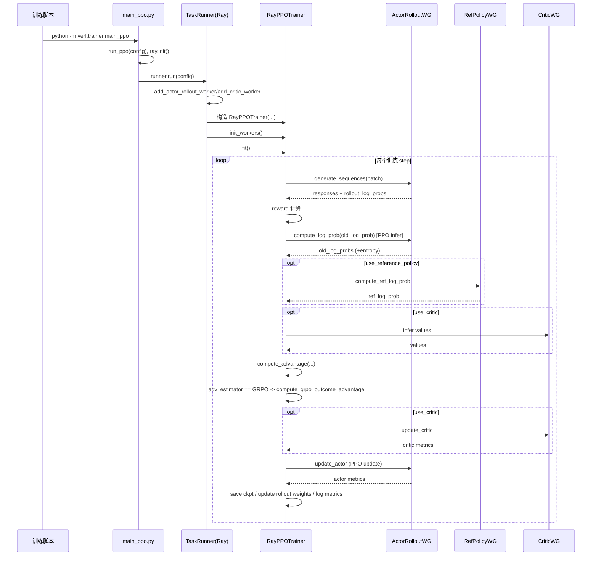
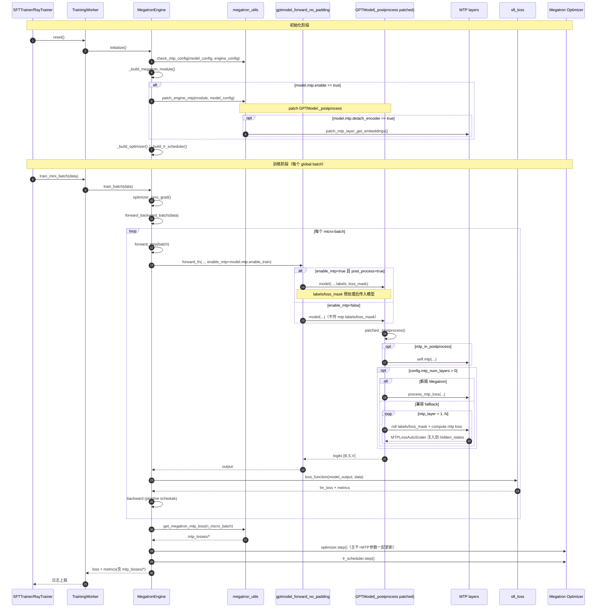

```mermaid
sequenceDiagram
    autonumber
    participant U as torchrun/sft_trainer
    participant W as TrainingWorker
    participant E as MegatronEngineWithLMHeadAndSpeculator
    participant T as Target Megatron Module(chunks, all TP ranks)
    participant O as Draft Owner Rank(tp0, cp0, last-pp-stage)
    participant S as Eagle3Strategy
    participant D as Eagle3 DraftModel(MCore DDP, owner only)

    Note over U,E: 初始化阶段
    U->>W: 创建 TrainingWorkerConfig(model_type=language_model_with_speculator)
    W->>E: reset() -> initialize()
    E->>E: _bootstrap_spec_decode()
    E->>T: super.initialize() (构建/包裹 target + optimizer)
    E->>E: _validate_pp_spec_decode_support()
    Note over E: PP>1 直接 fail-fast（当前不支持）
    E->>E: _is_draft_active_on_rank() -> 仅 owner=true
    E->>S: initialize(target_model, spec_decode_cfg, runtime_ctx)
    opt owner rank
        S->>D: build_draft_module(AutoDraftModel.from_pretrained/init)
        E->>E: _wrap_draft_with_megatron_ddp()
        E->>E: _build_draft_optimizer()
        E->>S: bind_draft_module(draft_model)
    end

    Note over U,E: 单次训练步（含 micro-batch）
    U->>W: train_mini_batch(data)
    W->>E: train_batch(data)
    E->>E: optimizer_zero_grad()
    E->>E: forward_backward_batch(...)

    loop 每个 micro-batch（Megatron schedule）
        E->>E: forward_step(batch)
        E->>E: _resolve_target_signal_request()

        E->>T: 在请求层注册 forward_hook
        E->>T: gptmodel_forward_no_padding(...)
        T-->>E: hook 回传各层 hidden（常见 [S,B,H]）
        E->>T: remove hooks
        E->>E: hidden postprocess + dense + detach
        alt TP>1 且 sequence_parallel=true
            E->>T: all_reduce(presence) + all_gather(hidden shard)
            T-->>O: owner 拼接为完整序列 hidden
        else TP=1 或无需 gather
            E->>O: owner 直接使用本地 hidden
        end
        E->>E: 构建 hidden_states_map（仅 owner 非空）

        alt owner rank
            E->>E: _build_target_runtime_view(...)
            E->>S: compute_step_loss(target_view)

            S->>S: extract_teacher_signals()
            S->>S: build_draft_forward_request()

            loop ttt_steps
                S->>D: forward(input_emb + projected_hidden/fused_hidden)
                D-->>S: hidden/logits
                S->>S: 准备下一步 TTT 输入（roll input/label/mask）
            end

            S->>S: compute_draft_loss(多步 CE 汇总)
            S-->>E: LossOutput(total_loss, metrics)
            E->>E: scaled_loss = loss * num_micro_batch
        else 非 owner rank
            E->>E: 返回 zero-loss 占位（维持 pipeline 反向契约）
        end
    end

    E->>E: optimizer_step()
    Note over E: target optimizer 在所有 rank 更新；draft optimizer 仅 owner 更新
    E-->>W: loss + metrics
    W-->>U: 日志/监控输出

