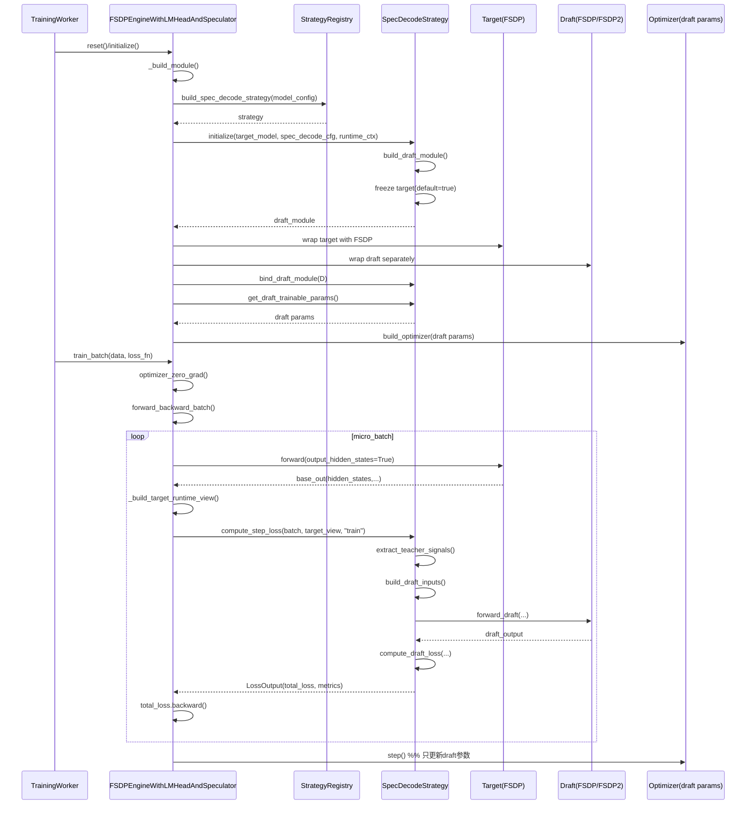
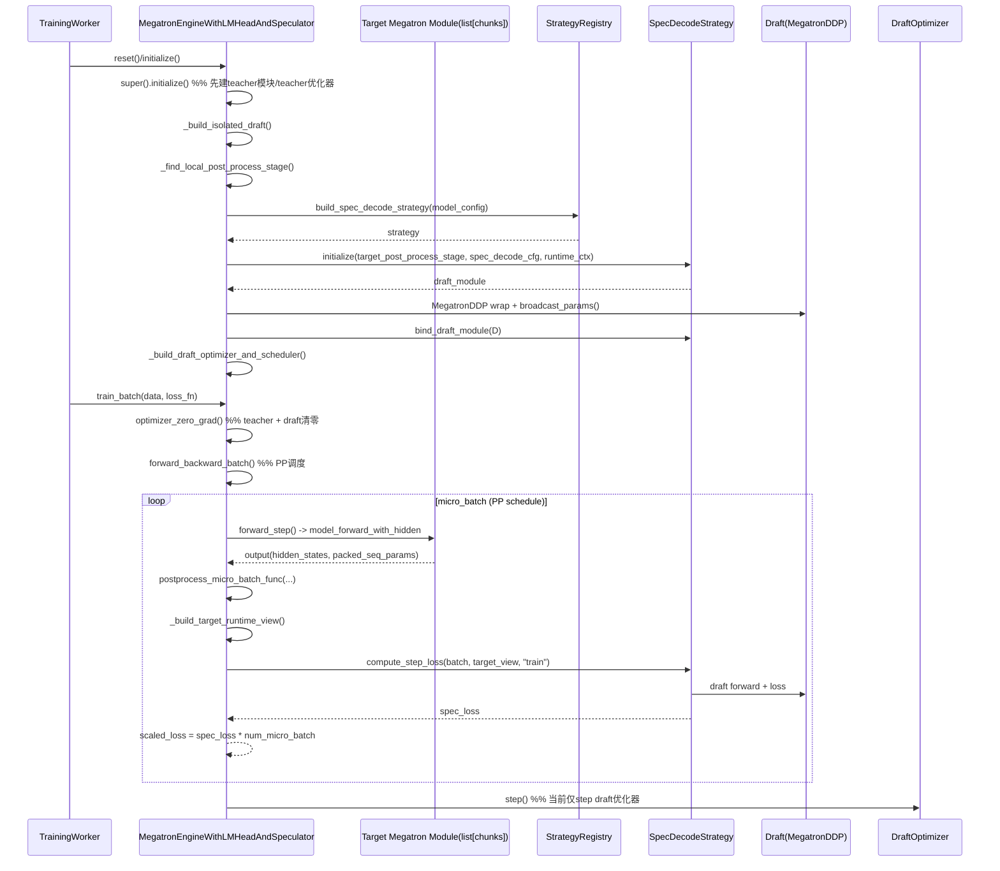
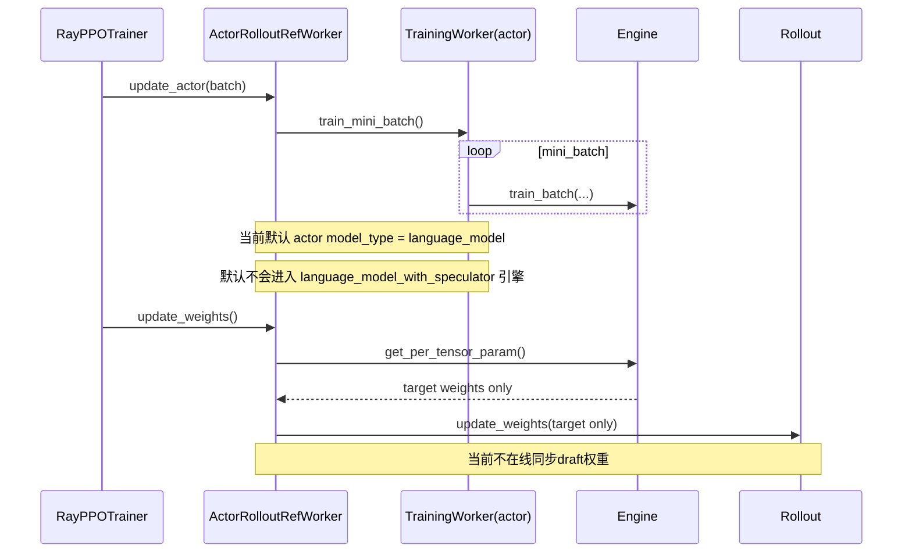
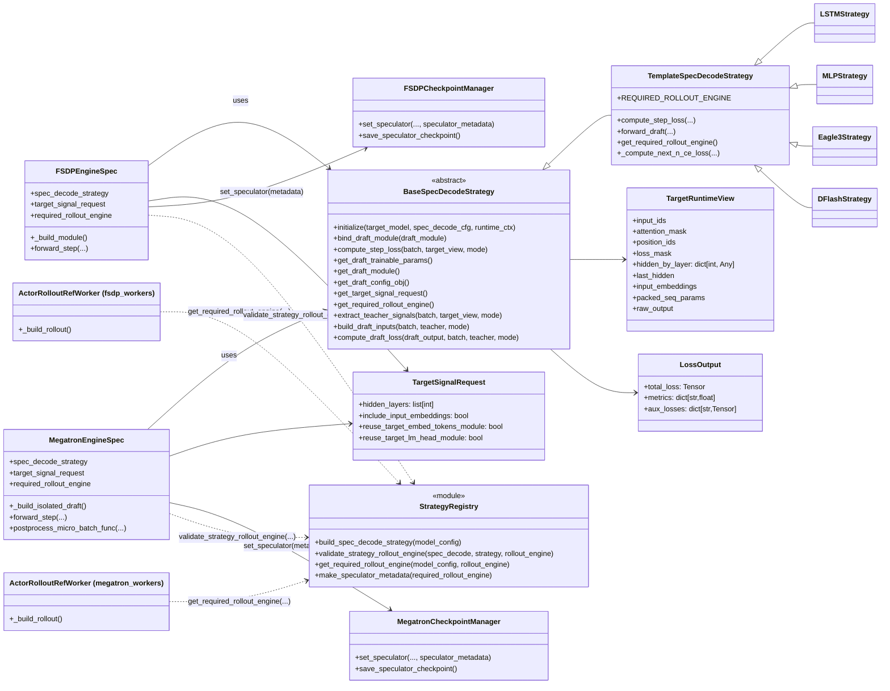
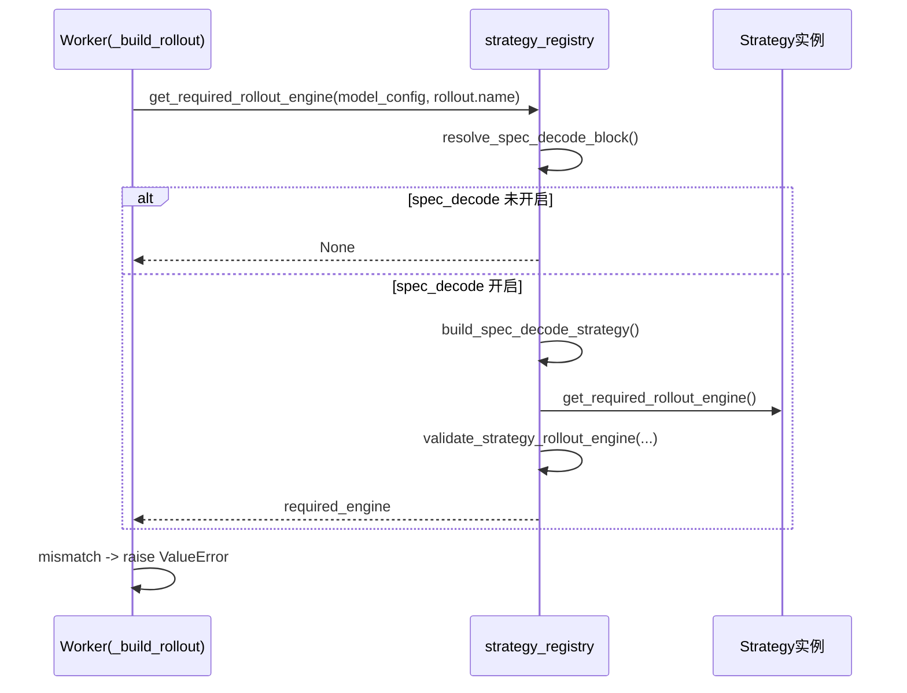
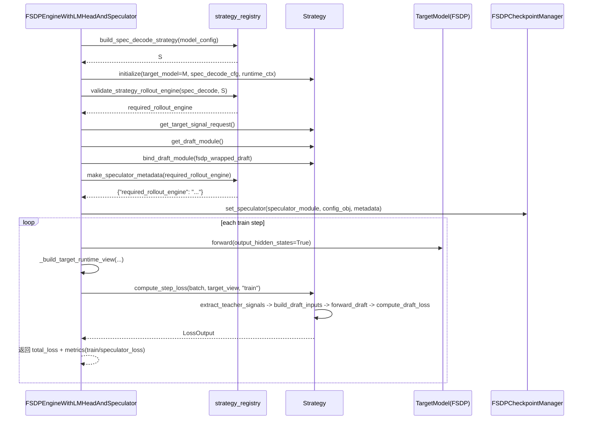
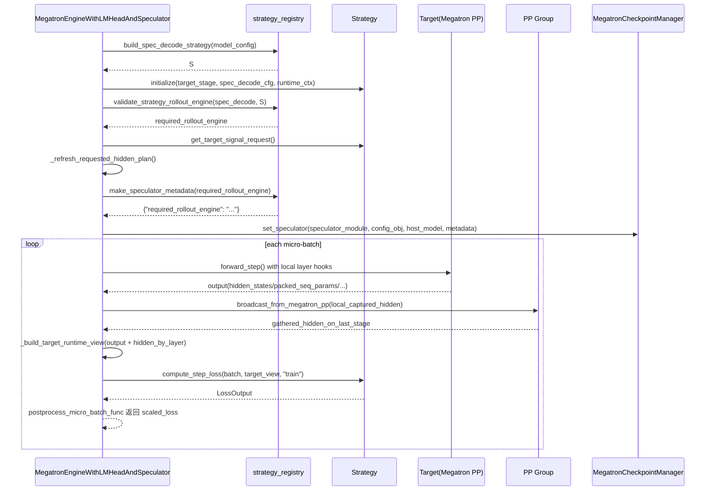

# Spec Decode Training (Strategy Architecture)

本文档描述当前 VERL 中投机解码草稿模型训练架构（FSDP + Megatron 统一）。

## 目标

- 训练流程与算法解耦：Engine 负责训练循环，Strategy 负责编排算法差异。
- 接入新草稿模型低成本：用户只需提供
  1. 草稿模型结构/配置（支持 `name/fqn/path+name` 加载）
  2. loss 计算逻辑（通过 strategy 钩子实现）
- 统一配置入口：`model.spec_decode.*`。

## 当前目录结构

```text
verl/trainer/speculators/
├── strategy_interface.py      # 统一接口与数据契约
├── base_strategy.py           # 模板方法与通用 CE loss
├── strategy_registry.py       # strategy 注册与加载
├── lstm_strategy.py           # LSTM strategy
├── mlp_strategy.py            # MLP strategy
├── eagle3_strategy.py         # EAGLE3 strategy
└── dflash_strategy.py         # DFlash strategy
```

## 核心职责划分

### 1) Engine（训练循环层）

- 文件：
  - `verl/workers/engine/fsdp/transformer_impl.py`
  - `verl/workers/engine/megatron/transformer_impl.py`
- 职责：
  - 运行 target forward
  - 按 `model.spec_decode.target_signals` 抽取 teacher signals，构造 `TargetRuntimeView`
  - 调用 `strategy.compute_step_loss(...)`
  - backward / optimizer step
  - 保存与加载 `speculator/` checkpoint

### 2) Strategy（算法编排层）

- 统一接口：`BaseSpecDecodeStrategy`
- 模板实现：`TemplateSpecDecodeStrategy`
- 子类只实现差异钩子：
  - `build_draft_module`
  - `extract_teacher_signals`
  - `build_draft_inputs`
  - `compute_draft_loss`

### 3) Draft Module（模型结构层）

- 仅负责 `nn.Module` 本身（结构、forward、参数初始化）
- 由 Strategy 在 `initialize(...)` 中构建并绑定

## 数据契约

### `TargetRuntimeView`

Engine 传给 Strategy 的 target 运行时视图，包含：

- `input_ids / attention_mask / position_ids / loss_mask`
- `hidden_by_layer`（按 `target_signals.hidden_layers` 裁剪后的多层 hidden）
- `last_hidden`
- `input_embeddings`（可选）
- `packed_seq_params`（Megatron packed 序列场景）

### `LossOutput`

Strategy 返回统一结构：

- `total_loss: torch.Tensor`
- `metrics: dict[str, float]`
- `aux_losses: dict[str, torch.Tensor]`

## 配置

统一使用：

```yaml
model:
  use_remove_padding: false

  spec_decode:
    strategy:
      name: lstm   # 或 fqn/path+name

    draft_model:   # 可选：纯 AutoModel 草稿模型
      path: /path/to/draft_hf_dir
      auto_class: AutoModel            # AutoModel | AutoModelForCausalLM
      trust_remote_code: true
      init: pretrained                 # pretrained | from_config

    strategy_config:
      n_predict: 3
      method: sum_lstm
      tie_lstm_embs: true
      tie_weights: true

    loss:
      name: next_n_ce
      config: {}

    target_signals:
      hidden_layers: [-1]
      include_input_embeddings: false
```

说明：

- 旧键 `model.speculator` / `model.speculator_adapter` 已移除。
- 如果提供旧键会直接报错，要求迁移到 `model.spec_decode`。
- `strategy_config` 等价于旧 `config`，两者都支持；优先读取 `strategy_config`。
- 当配置 `draft_model` 时，strategy 默认会走 AutoModel 加载草稿模型，teacher-draft 组装逻辑仍在 strategy 内。


1. FSDP Engine：初始化 + 训练一步（spec decode）


2. Megatron Engine：初始化 + 训练一步（spec decode）


DraftOptimizer
Draft(MegatronDDP)
SpecDecodeStrategy
StrategyRegistry
Target Megatron Module(list[chunks])
MegatronEngineWithLMHeadAndSpeculator
TrainingWorker
DraftOptimiz




3. PPO/GRPO 链路里与 spec decode 的关系（当前实现）



-----


0302













不同backend engine 、rollout engine下权重更新逻辑：

核心是两层解耦：训练引擎负责导出 teacher 权重，rollout 引擎负责接收并装载。

训练侧（按 engine 区分）

FSDP 路径：在 worker 里从 FSDP 模型取 state_dict（或 LoRA 参数），再做 convert_weight_keys，最后调用 rollout.update_weights(...)。见 fsdp_workers.py:681、fsdp_workers.py:704、fsdp_workers.py:751。
Megatron 路径：在 worker 里通过 bridge 导出权重（export_weights/export_hf_weights/export_adapter_weights），再调用 rollout.update_weights(...)。见 megatron_workers.py:715、megatron_workers.py:748。
通用 engine worker 还有一条分支：若 checkpoint backend 不是 naive，不直接喂 rollout，而是 checkpoint_engine.send_weights(...)。见 engine_workers.py:579。
rollout 侧（按 rollout 引擎区分）

统一接口都是 BaseRollout.update_weights(weights, **kwargs)。见 base.py:52。
vLLM：走 CUDA IPC bucket，远端执行 update_weights_from_ipc。见 vllm_rollout.py:146。
SGLang：按 bucket 切分后调用 sgl_update_weights。见 sglang_rollout.py:179。
TRTLLM：把 tensor 转 IPC handle，汇总后调用 server update_weights。见 trtllm_rollout.py:378。
结论

“不同 engine”的差异主要在teacher 权重如何导出/命名转换。
“不同 rollout 引擎”的差异主要在传输与装载协议。
两者通过统一的 update_weights 契约对接。
另外 spec decode 下还会做 strategy -> required_rollout_engine 校验，防止不兼容组合。见 strategy_registry.py:145。
