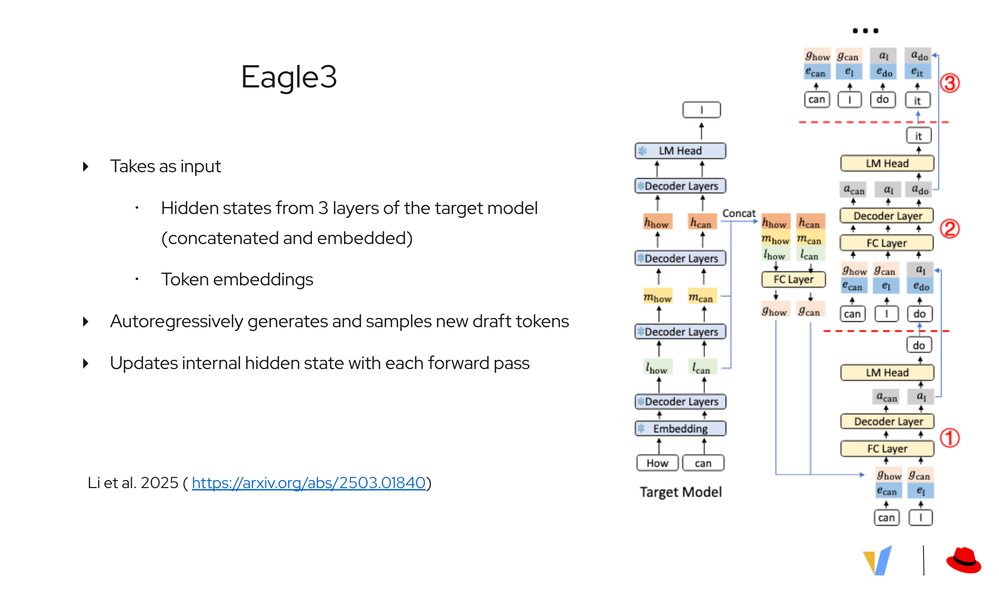
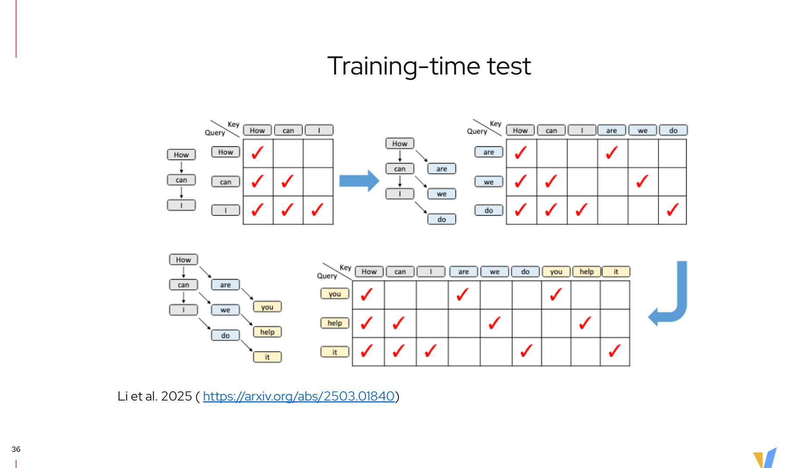
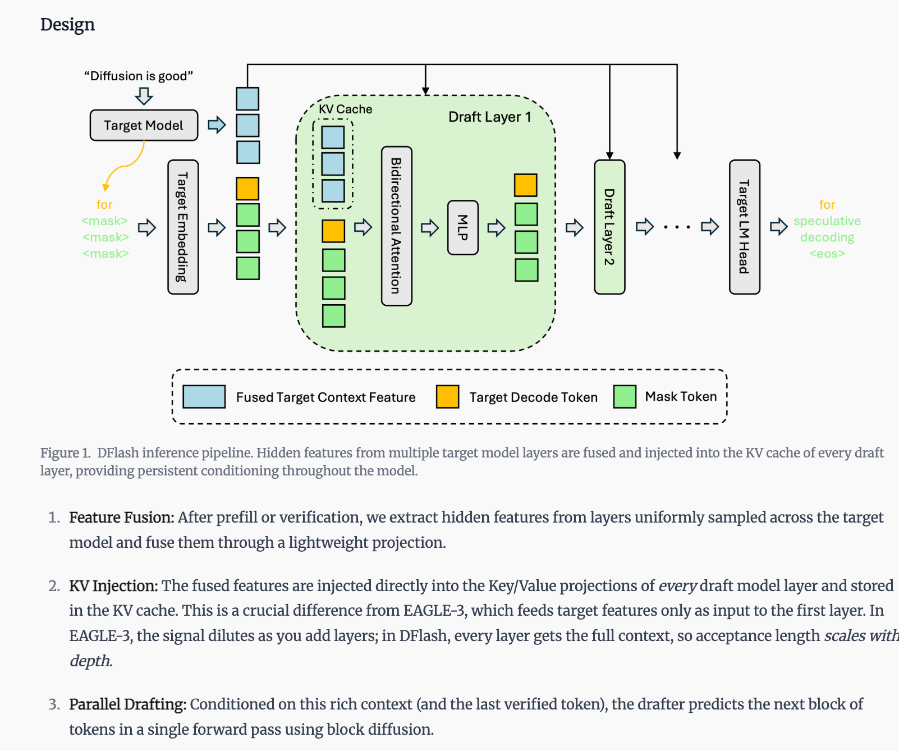
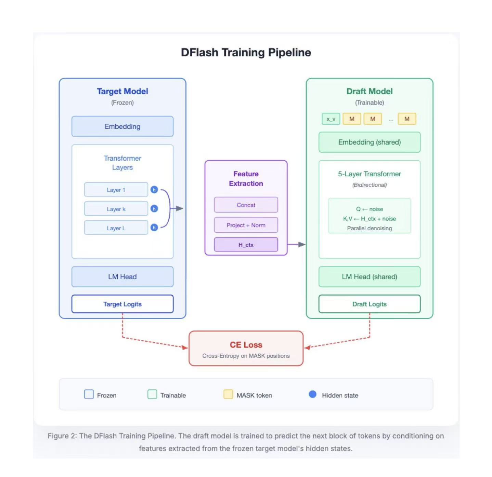
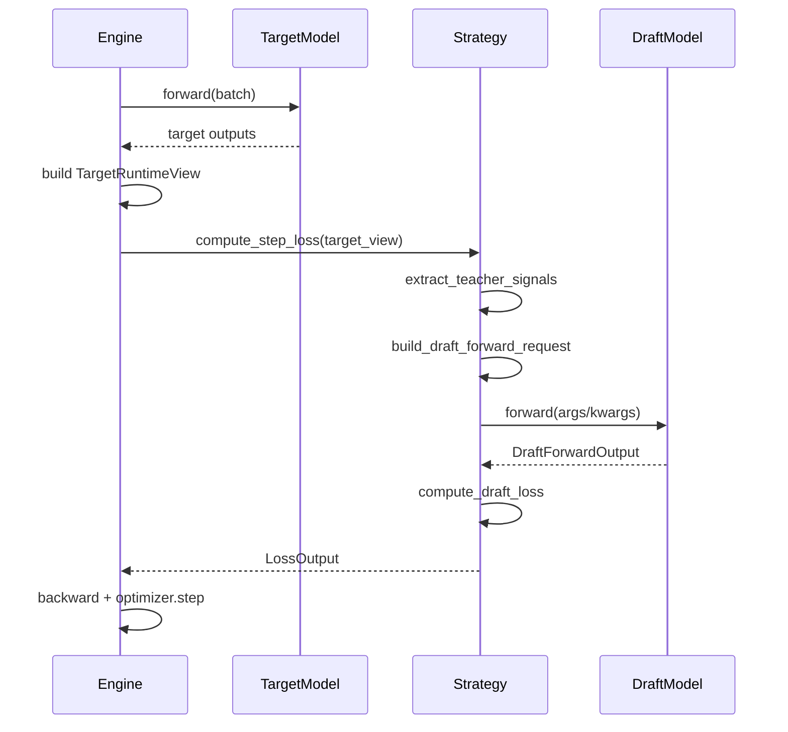

1 目标对齐
- rl时可以使用投机解码加速rollout 效率
- rl时同时训练草稿模型，保证rl后草稿模型的预测效率（原本的草稿模型可能基于rl前的）

2 实现思路调整(考虑到eagle3 和 dflash)

3 当前遇到的一些问题

- 问题1： pp>1 时草稿模型比较难拿到target model的hidden states
- 问题2：草稿模型和target model 分布式策略不统一，草稿模型只能ddp,草稿模型和target model 使用的是单独优化器优化
- 问题3：rollout 时草稿模型的权重同步问题（需要额外扩展“第二套权重导出+rollout端加载”）

eagle3







dflash








## 1. 业务建模与抽象





## 2. 三层职责划分

1. Engine 层（训练循环）
- 负责 target forward、构建 `TargetRuntimeView`、调用 strategy、反向传播与优化器 step。
- 不关心某个算法如何拼接 hidden states 或如何算 loss。

2. Strategy 层（算法编排）
- 定义“要哪些 teacher 信号”。
- 定义“如何把 teacher 信号组装成 draft 前向输入”。
- 定义“如何把 draft 输出转成训练损失”。

3. DraftModel 层（纯模型结构）
- 继承自HF `PretrainedConfig + PreTrainedModel`，可 `AutoDraftModel.from_pretrained(...)`加载；
- 仅包含模型结构和 forward


## 3. 核心数据结构


### 3.1 TargetRuntimeView

Engine 传给 Strategy 的 target model 运行时视图：
- `input_ids`
- `attention_mask`
- `position_ids`
- `loss_mask`
- `labels`
- `hidden_by_layer: dict[int, Any]`
- `input_embeddings`（optional）
- `packed_seq_params`
- `raw_output`
- `backend_payload`

### 3.2 TargetSignalRequest

Strategy 声明 teacher 需求：
- `hidden_layers: list[int]`
- `include_input_embeddings: bool`
...


### 3.3 DraftForwardRequest / DraftForwardOutput

标准化 draft 前向输入输出：
- `DraftForwardRequest(args, kwargs)`
- `DraftForwardOutput(logits, hidden_states, raw_output, extras)`

### 3.4 LossOutput

统一损失返回：
- `total_loss: Tensor`
- `metrics: dict[str, float]`
- `aux_losses: dict[str, Tensor]`

## 4. Strategy 协议

核心接口

```python
class BaseSpecDecodeStrategy(ABC):
    def initialize(target_model, spec_decode_cfg, runtime_ctx) -> None: ...
   
    def compute_step_loss(target_view) -> LossOutput: ...


    def extract_teacher_signals(target_view) -> dict: ...
    def build_draft_forward_request(teacher) -> DraftForwardRequest: ...
    def forward_draft(draft_request) -> DraftForwardOutput: ...
    def compute_draft_loss(draft_output, teacher) -> LossOutput: ...
```


