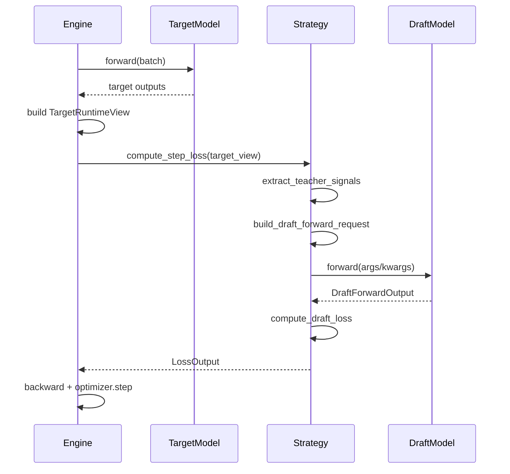
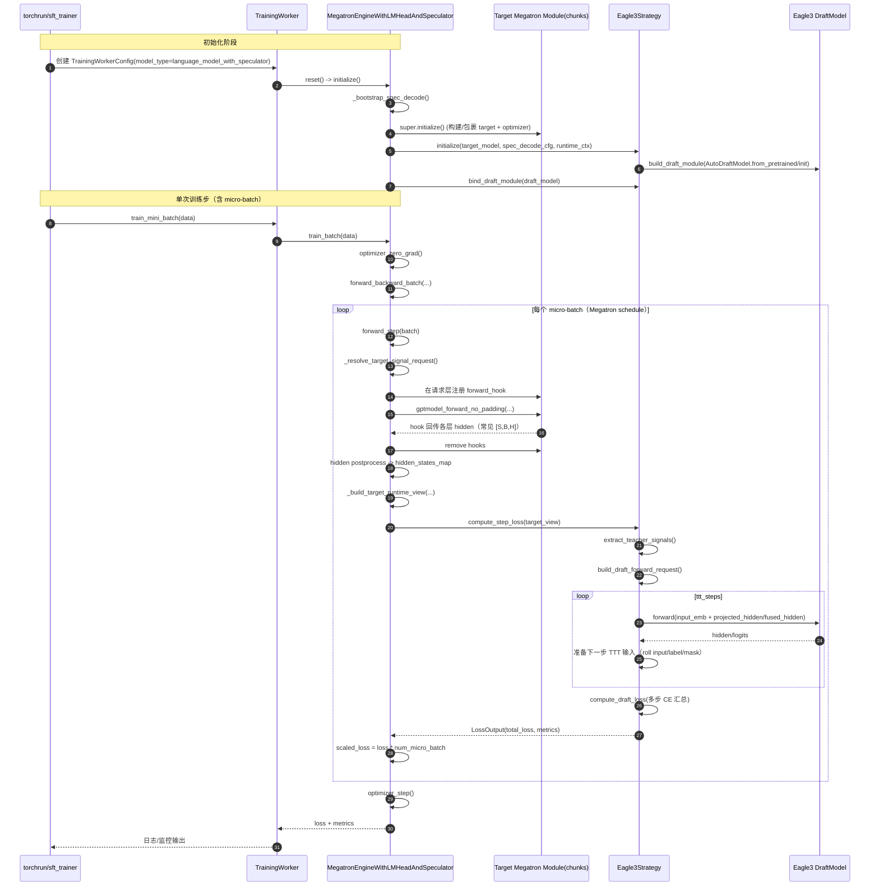
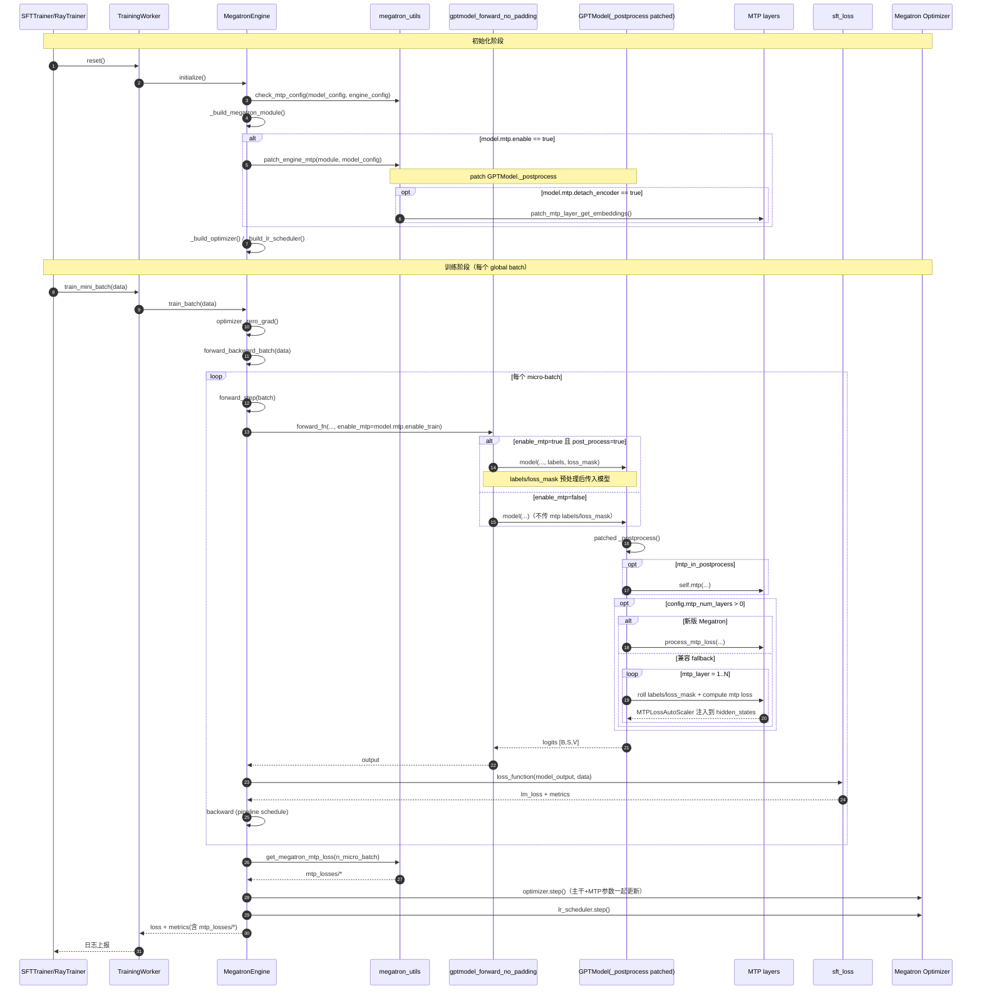

# Spec Decode 纯接口设计（Draft AutoModel + Strategy 编排）

## 1. 设计目标

1. 训练流程与具体投机解码算法解耦。
2. 草稿模型（draft）按纯 HuggingFace `AutoModel` 体系接入。
3. teacher 与 draft 的组装、连接、特征抽取、loss 计算全部放在 `Strategy`。
4. Engine（FSDP/Megatron）只负责训练循环，不持有算法分支。

## 2. 三层职责划分

1. Engine 层（训练循环）
- 负责 target forward、构建 `TargetRuntimeView`、调用 strategy、反向传播与优化器 step。
- 不关心某个算法如何拼接 hidden states 或如何算 loss。

2. Strategy 层（算法编排）
- 定义“要哪些 teacher 信号”。
- 定义“如何把 teacher 信号组装成 draft 前向输入”。
- 定义“如何把 draft 输出转成训练损失”。

3. DraftModel 层（纯模型结构）
- 必须是标准 HF `PretrainedConfig + PreTrainedModel`，可 `AutoModel.from_pretrained(...)`。
- 仅包含模型结构和 forward，不包含 teacher 依赖逻辑。

## 3. 配置接口（统一入口）

```yaml
model:
  spec_decode:
    strategy:
      name: eagle3                      # 或 fqn / path+name

    draft_model:
      path: /path/to/draft_hf_dir
      auto_class: AutoModel             # AutoModel | AutoModelForCausalLM
      trust_remote_code: true
      init: pretrained                  # pretrained | from_config

    strategy_config: {}                 # strategy 私有超参
    loss:
      name: next_n_ce                   # 或自定义 fqn
      config: {}

    target_signals:
      hidden_layers: [-1, -8, -16]
      include_input_embeddings: false
```

约定：
- `strategy_config` 优先；兼容读取旧 `config`。
- `draft_model` 缺省时，允许 strategy 自己构建内置 draft（兼容历史策略）。
- `draft_model.init` 支持两种模式：
  - `pretrained`：从 `draft_model.path` 加载已有权重（默认）。
  - `from_config`：仅按配置初始化模型；优先读取 `draft_model.path` 下配置，失败时回退 target config，适合无权重模板。
- `strategy` 是纯编排层，不允许新增/持有可训练参数；新增可训练层必须下沉到 `draft_model`。

## 4. 核心数据契约

### 4.1 StrategyRuntimeContext

运行时环境能力声明：
- `backend`
- `device_name`
- `torch_dtype`
- `supports_packed_seq`
- `supports_input_embeddings`
- `supports_multi_layer_hidden`

### 4.2 TargetRuntimeView

Engine 传给 Strategy 的 teacher 运行时视图：
- `input_ids`
- `attention_mask`
- `position_ids`
- `loss_mask`
- `labels`（缺省时由 Engine 回退为 `input_ids`）
- `hidden_by_layer: dict[int, Any]`
- `last_hidden`
- `input_embeddings`
- `packed_seq_params`
- `raw_output`
- `backend_payload`

### 4.3 TargetSignalRequest

Strategy 声明 teacher 需求：
- `hidden_layers: list[int]`
- `include_input_embeddings: bool`
- `reuse_target_lm_head_module: bool`

### 4.4 DraftModelSpec

纯 AutoModel 加载规范：
- `path: str`
- `auto_class: str`
- `trust_remote_code: bool`
- `init: str`

### 4.5 DraftForwardRequest / DraftForwardOutput

标准化 draft 前向输入输出：
- `DraftForwardRequest(args, kwargs)`
- `DraftForwardOutput(logits, hidden_states, raw_output, extras)`

### 4.6 LossOutput

统一损失返回：
- `total_loss: Tensor`
- `metrics: dict[str, float]`
- `aux_losses: dict[str, Tensor]`

## 5. Strategy 协议

```python
class BaseSpecDecodeStrategy(ABC):
    def initialize(target_model, spec_decode_cfg, runtime_ctx) -> None: ...
    def bind_draft_module(draft_module) -> None: ...
    def compute_step_loss(target_view) -> LossOutput: ...

    def get_draft_trainable_params(): ...
    def get_draft_module(): ...
    def get_draft_config_obj(): ...
    def get_target_signal_request() -> TargetSignalRequest: ...
    def get_required_rollout_engine() -> str: ...

    def extract_teacher_signals(target_view) -> dict: ...
    def build_draft_forward_request(teacher) -> DraftForwardRequest: ...
    def forward_draft(draft_request) -> DraftForwardOutput: ...
    def compute_draft_loss(draft_output, teacher) -> LossOutput: ...
```

模板基类 `TemplateSpecDecodeStrategy` 固定主流程：
1. `extract_teacher_signals`
2. `build_draft_forward_request`
3. `forward_draft`（统一输出标准化）
4. `compute_draft_loss`

## 6. Engine 与 Strategy 的交互边界

Engine 只做：
1. `target forward`
2. `_build_target_runtime_view`
3. `loss_output = strategy.compute_step_loss(target_view)`
4. `backward/optimizer step`

Strategy 只做：
1. teacher 信号选择
2. draft 输入组装
3. loss 计算

## 7. 新增草稿模型的最小接入成本

只需两步：
1. 提供一个可 `AutoModel` 加载的 draft 模型目录（config + modeling + 权重）。
2. 选择已有 strategy，或新增一个 strategy（仅实现组装逻辑和 loss 逻辑）。

Engine 不需要改。

## 8. 训练时序（抽象）



## 9. 关键设计结论

1. Draft 模型接口保持“纯模型”，不绑定 teacher。
2. 算法差异统一收敛到 Strategy。
3. Engine 始终稳定，只消费统一接口。
4. 接入新模型时编码量最小，且不会破坏训练主流程。






