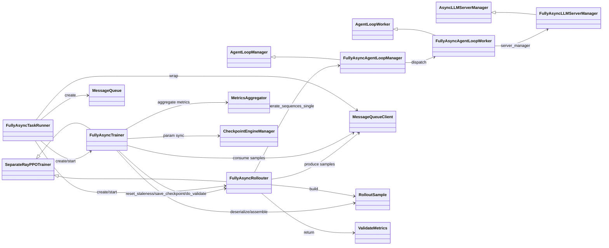

```mermaid
classDiagram
direction LR

class SeparateRayPPOTrainer
class FullyAsyncRollouter
class FullyAsyncTrainer
class AgentLoopManager
class FullyAsyncAgentLoopManager
class AgentLoopWorker
class FullyAsyncAgentLoopWorker
class AsyncLLMServerManager
class FullyAsyncLLMServerManager
class MessageQueue
class MessageQueueClient
class RolloutSample
class ValidateMetrics
class MetricsAggregator
class CheckpointEngineManager
class FullyAsyncTaskRunner

SeparateRayPPOTrainer <|-- FullyAsyncRollouter
SeparateRayPPOTrainer <|-- FullyAsyncTrainer

AgentLoopManager <|-- FullyAsyncAgentLoopManager
AgentLoopWorker <|-- FullyAsyncAgentLoopWorker
AsyncLLMServerManager <|-- FullyAsyncLLMServerManager

FullyAsyncTaskRunner --> FullyAsyncRollouter : create/start
FullyAsyncTaskRunner --> FullyAsyncTrainer : create/start
FullyAsyncTaskRunner --> MessageQueue : create
FullyAsyncTaskRunner --> MessageQueueClient : wrap
FullyAsyncTrainer --> MessageQueueClient : consume samples
FullyAsyncRollouter --> MessageQueueClient : produce samples

FullyAsyncRollouter --> FullyAsyncAgentLoopManager : generate_sequences_single
FullyAsyncAgentLoopManager --> FullyAsyncAgentLoopWorker : dispatch
FullyAsyncAgentLoopWorker --> FullyAsyncLLMServerManager : server_manager

FullyAsyncTrainer --> CheckpointEngineManager : param sync
FullyAsyncTrainer --> FullyAsyncRollouter : reset_staleness/save_checkpoint/do_validate
FullyAsyncTrainer --> MetricsAggregator : aggregate metrics

FullyAsyncRollouter --> RolloutSample : build
FullyAsyncTrainer --> RolloutSample : deserialize/assemble
FullyAsyncRollouter --> ValidateMetrics : return

```